# Все об ITSM

## ITSM (IT Service Management)

это подход к управлению IT-сервисами, который описывает процессы обработки инцидентов, запросов пользователей и изменений системы.

## Основная методология — ITIL.

ITIL (Information Technology Infrastructure Library) — это ведущая международная библиотека лучших практик (фреймворк) для управления IT-услугами (ITSM), помогающая компаниям согласовывать ИТ-процессы с бизнес-стратегией. Она обеспечивает максимальную эффективность, прозрачность и создание ценности для клиентов, охватывая все этапы от проектирования до поддержки.

### Основные характеристики и цели ITIL:

Ориентация на бизнес: ИТ рассматриваются не как техническая поддержка, а как услуги, приносящие ценность бизнесу.

Структура (ITIL 4): Современная версия (ITIL 4) ориентирована на гибкость, цифровизацию и включает 34 практики, объединяющие процессы, людей и технологии.
Основные этапы (Жизненный цикл, ITIL v3/4): Стратегия, Проектирование, Внедрение, Эксплуатация (Service Operation) и Непрерывное улучшение услуг.

**Цель:** Оптимизация ресурсов, повышение качества обслуживания пользователей и снижение рисков.

**ITIL часто путают с ITSM (IT Service Management):**
ITIL — это набор рекомендаций (теория), а ITSM — это подход, реализующий эти рекомендации на практике.

1C-Connect
корпоративная почта
CRM
Service Desk
ERP

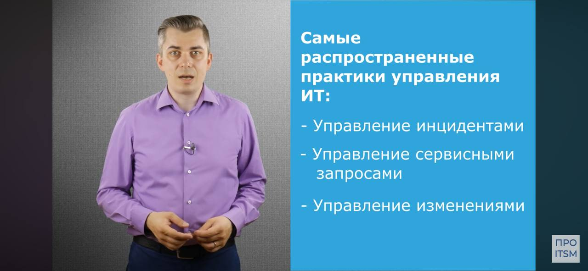

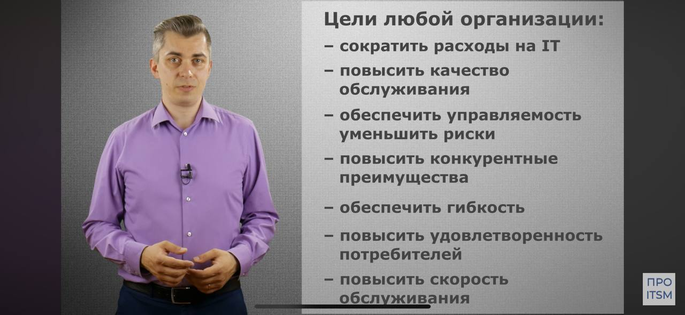

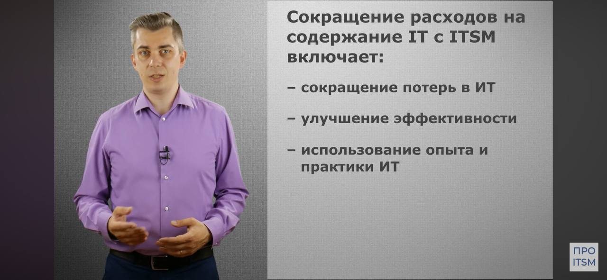

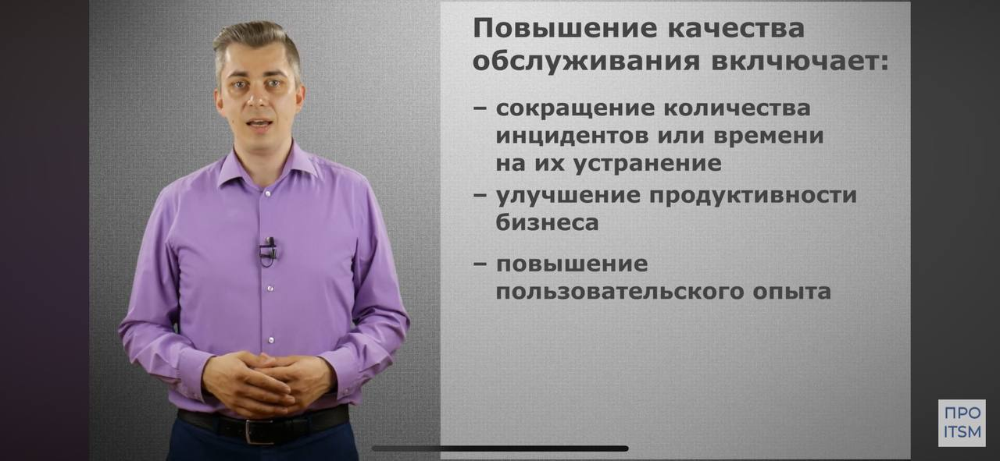

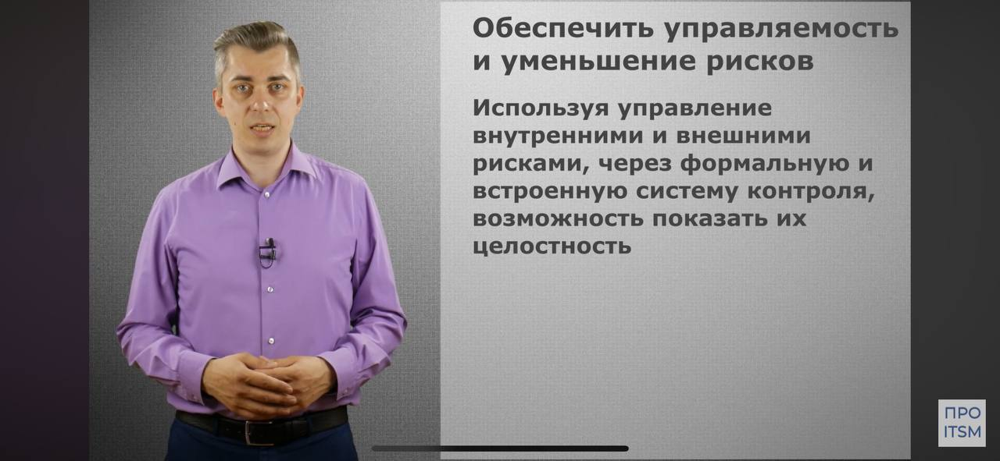

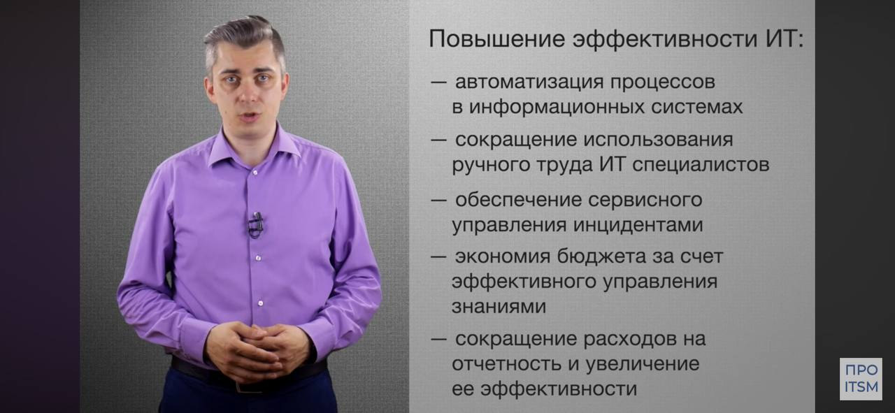

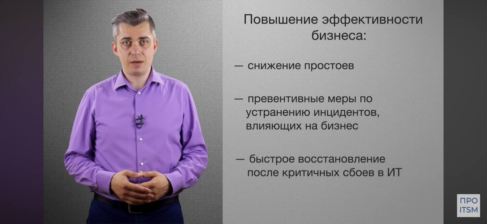

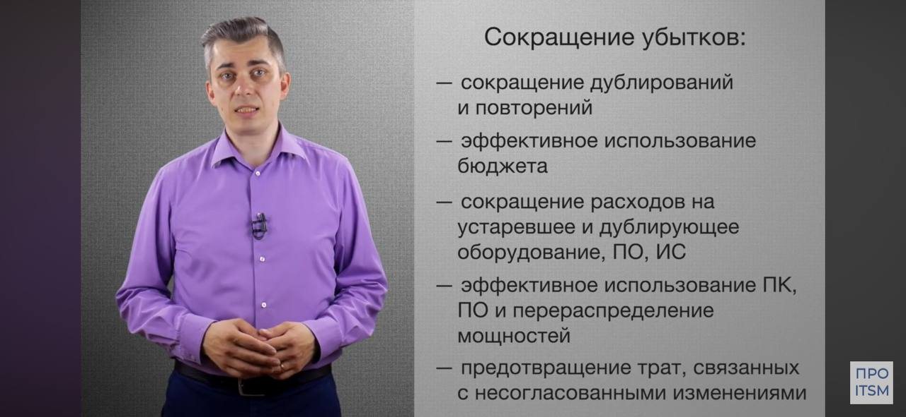

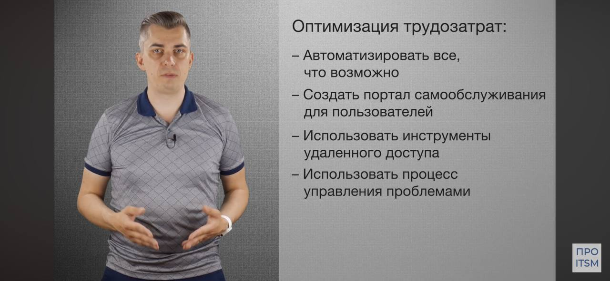

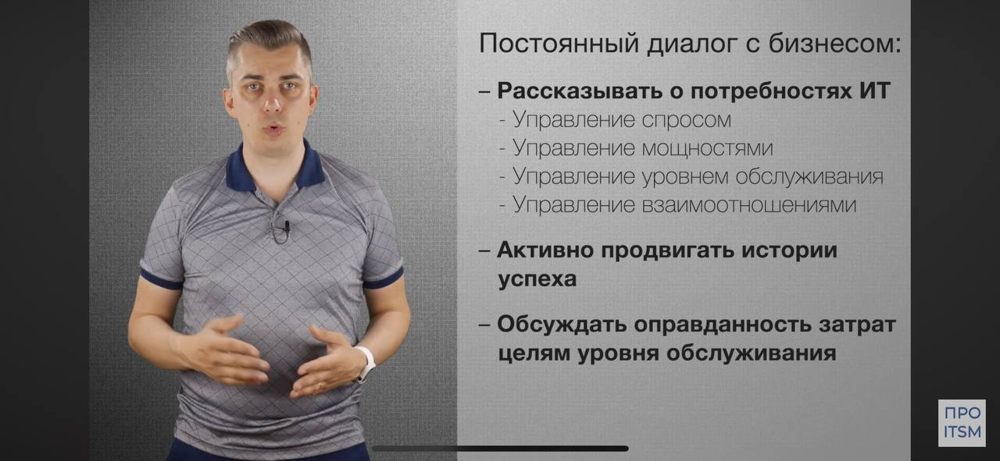

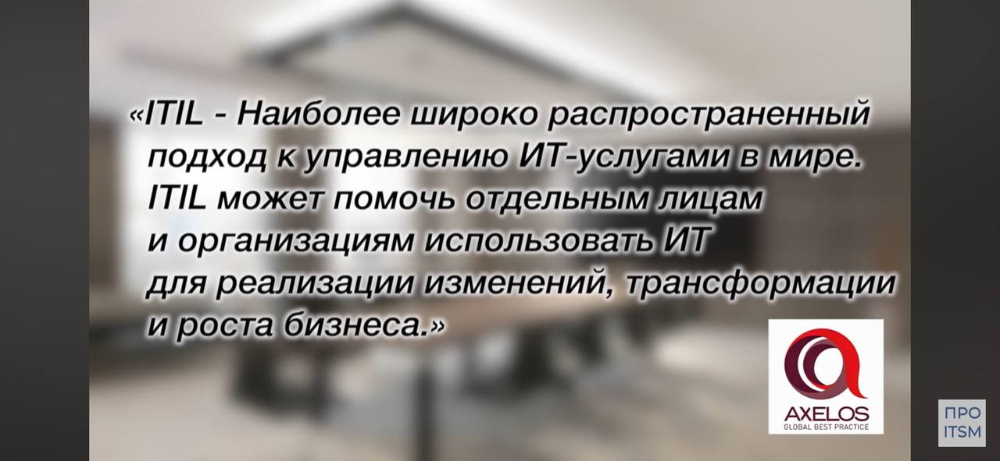

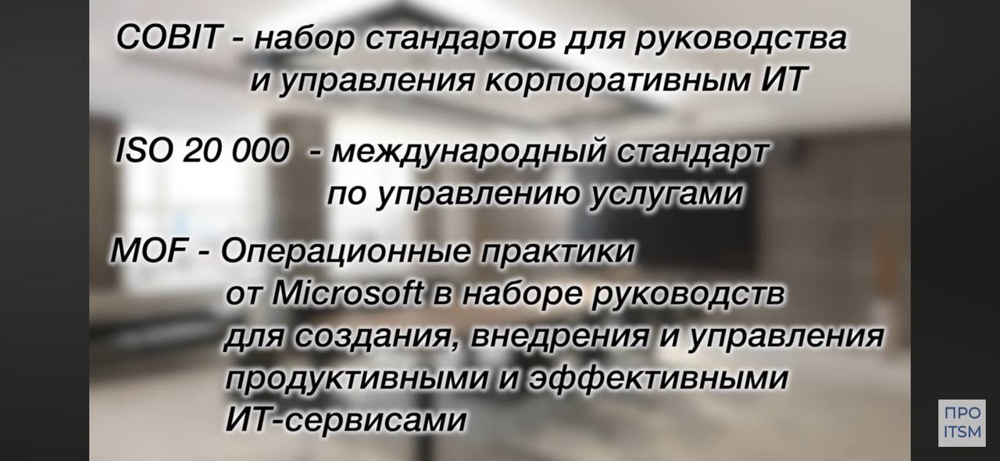

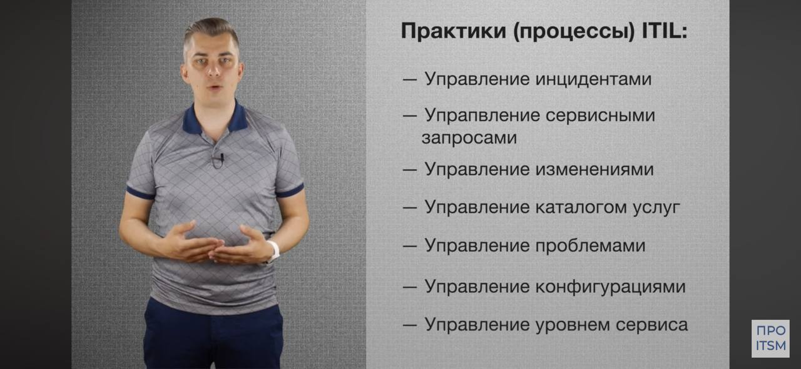

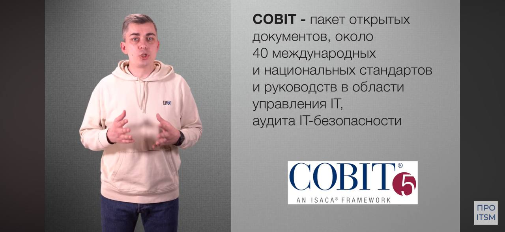

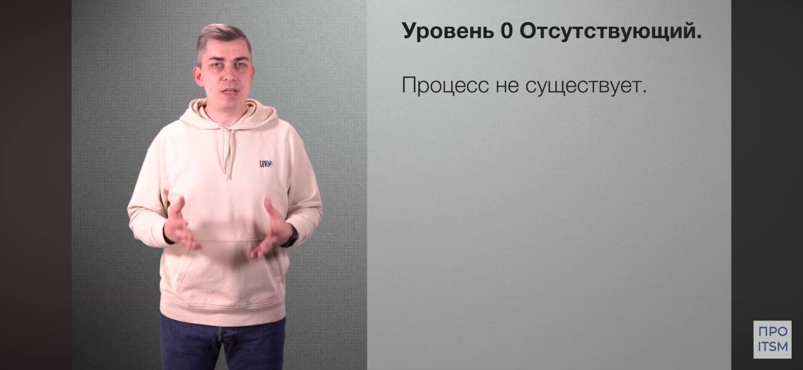

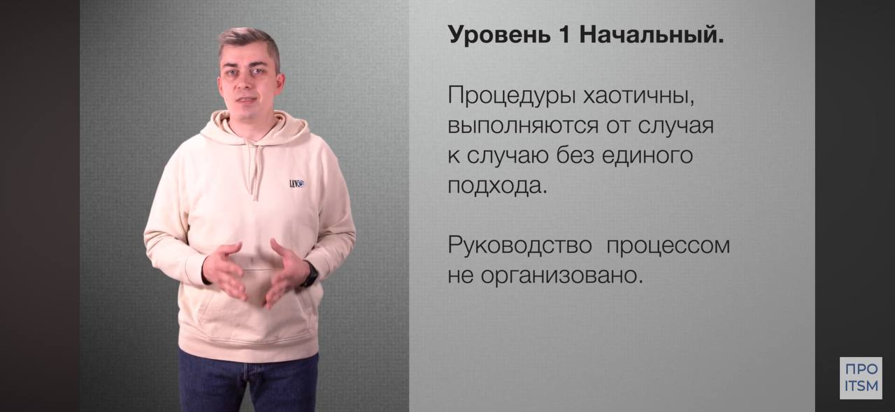

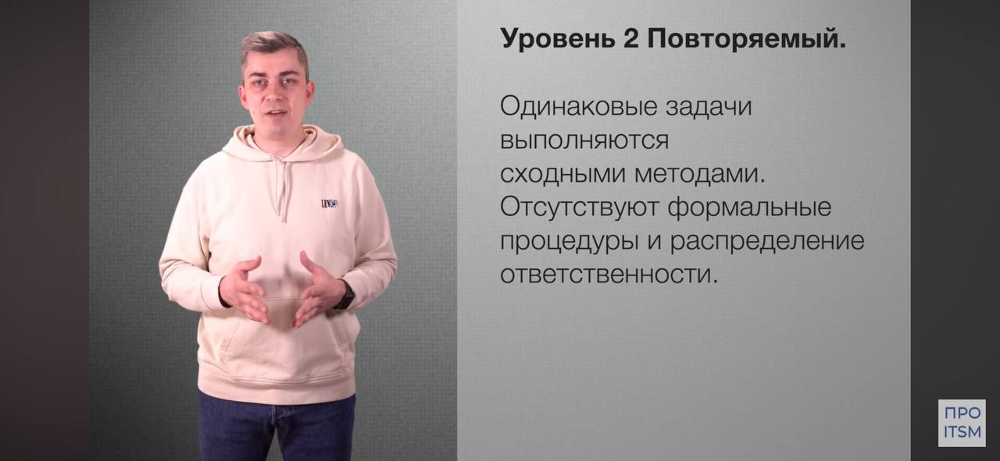

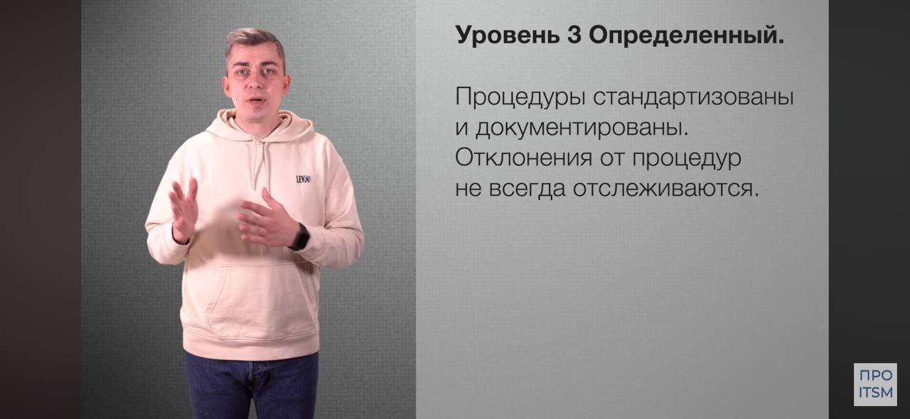

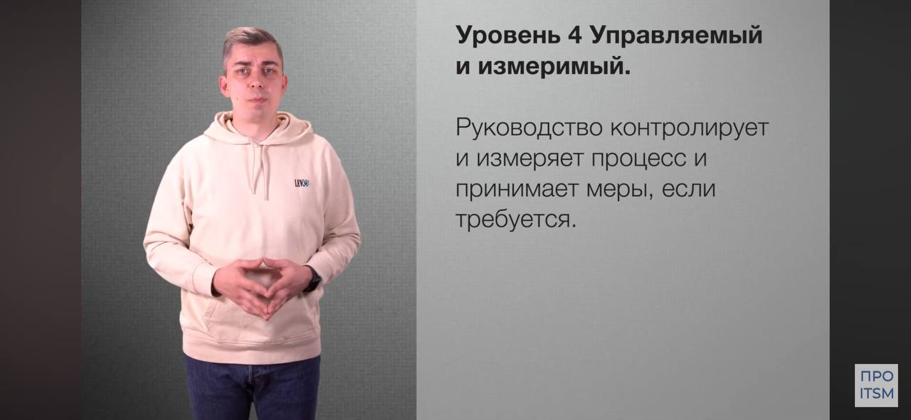

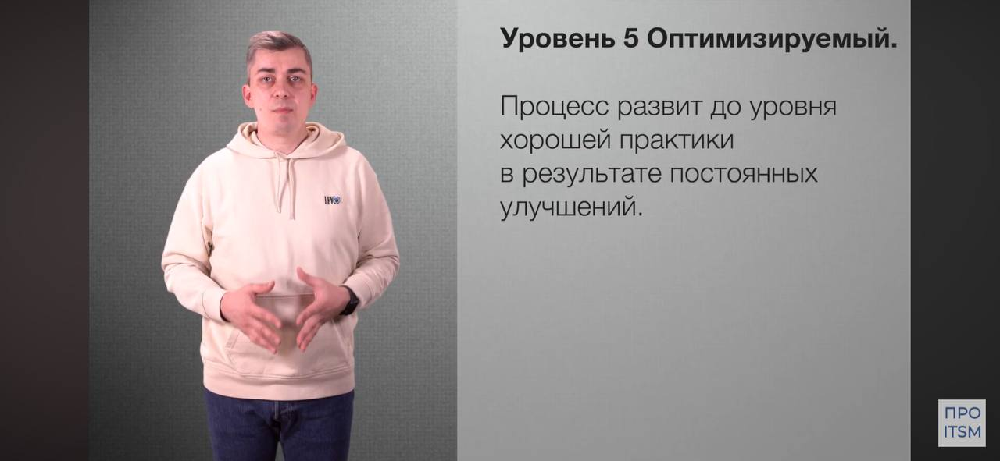

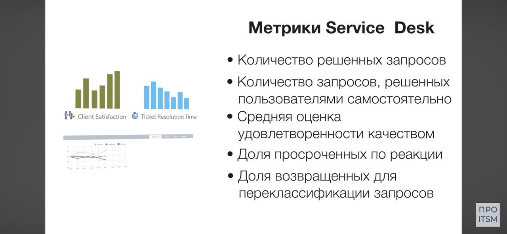